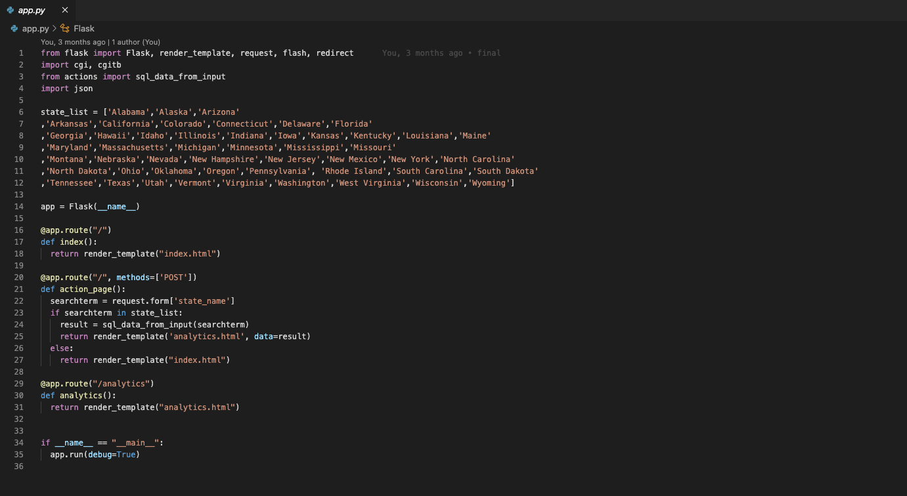
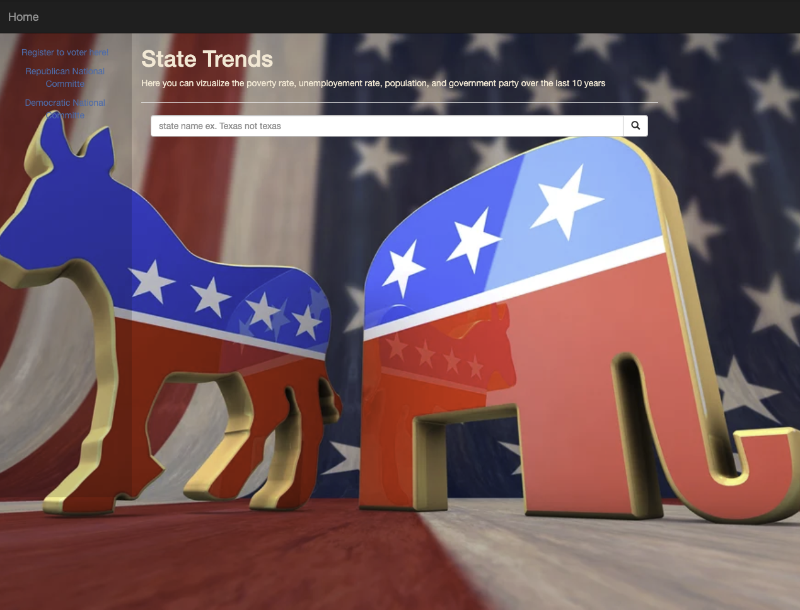
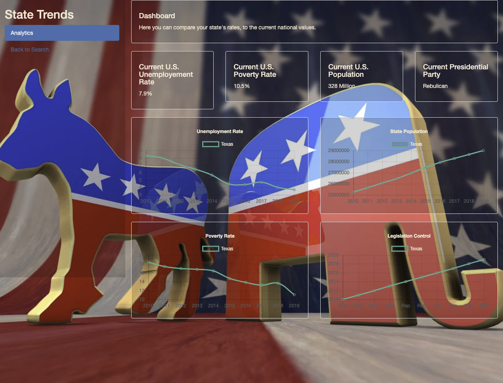

# State Party vs State Trends

## Intro

Recently I was watching one of my favorite youtube channels and a political ad came on from Prager University, which I had never heard of. In this short youtube ad, they begun to explain how people were moving out of the three big blue states to red states at a one million per state per year. 
So I began to wonder one, if this was true, and two if there was any reason why or if I could show this via data. 
So the data I chose to show was, poverty rate, unemployment rate, population, state legislature weither democratic or republican. 
For the state legislature,data was pulled from the National Conference of State Legislatures. (nscl.org)
For the poverty rate, data was pulled via csv from the census. (census.gov)
For the unemployment rate, data was pulled from the U.S. Bureau of Labor Statistics via their public data api, then written to a csv. (bls.gov) 
For the population, data was also pulled from the census. (cenus.gov)

## app.py

Here is the python flask application. 
This is what makes everything work together. 
Here are the routes for the proper html pages and also most importantly, how we are able to pass data from python to html, to javascript and back.

## index.html

This is the landing page for the app. Here the user inputs the state they are wanting to see data from. 
The input is taken and searched through a list of the 50 states. If the input is actually a state, the route begins. 
If the input is not one of the fifty states, the page reloads. 
On the left there are three links, one is to register to vote, one is for the republican party, the next is for the democratic party. 

## action.py

This is where data is being retrieved. 
In this python file we make different functions to get each section of our data. 
We also make our connection to our sql database here. 
The data is pulled from our sql database for our x and y values for our line graph based on the user's inputed state.
Then that data is returned as an array, writtin to a dictionary. So in turn we get a double nested array.
This will help us when we want to access elements of this data for our graphs.
At the end of this action.py, our entire data dictionary is returned to our app.py flask page.

## analytics.html

This is our second html page that will display the data from our sql queries in our graphs. 
This was the hardest part of this entire project because no matter what I did or how I wrote it in the javascript, It kept breaking the graphs. 
This was before I did the double nested array though. Once I did that, accessing the data was very simple, just time consuming. 
I'm sure I could have written a loop in the javascript to rip the elements out but I accessed them like data.unemployment_rate[0][1].
Once this is passed, BOOM, we have data visulization!
On the left nav bar there is a link to "back to search", this takes the user back to index.html and the user can enter another state to see another states data.
4 different graphs update from the same data dictionary based on the users input. 
Also when the user mouses over a point on the line graph, a pop up shows the data point. 

## unemployment.py 1 and 2

Here is where the api calls are made for the data from the bls. 
The api would only allow data to return 25 at a time so I split it into two different files and just split the 50 states down the middle.
Once the python file is ran, the results are written to cvs's for each state seperately. 
Combining the cvs and removing un needed data was done in the data cleaning along with the rest of the csv's. 

## SQL database

From the  "cleaned" csv's, the data was imported into 4 different tables in one sql database.
I say "Cleaned" becuase although I thought it was ready to call from, I realized once I started making query's that I was getting too much information. Finding double enteries.
Luckily, once the sql database is updataed, the sqlAlchemy query's are correct and don't need to be changed. 

## chart.js 

Chart.js was a javascript library I found that had a nice quick animation before it displayed the data in its graph. 
